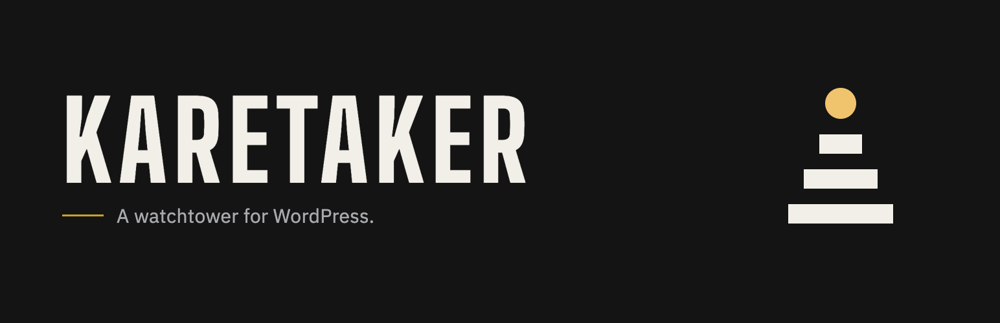
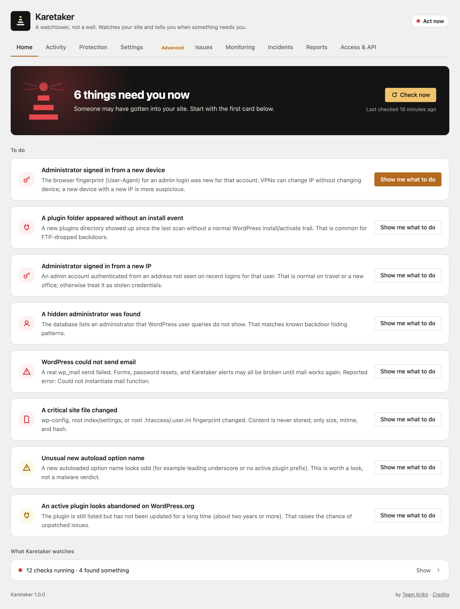
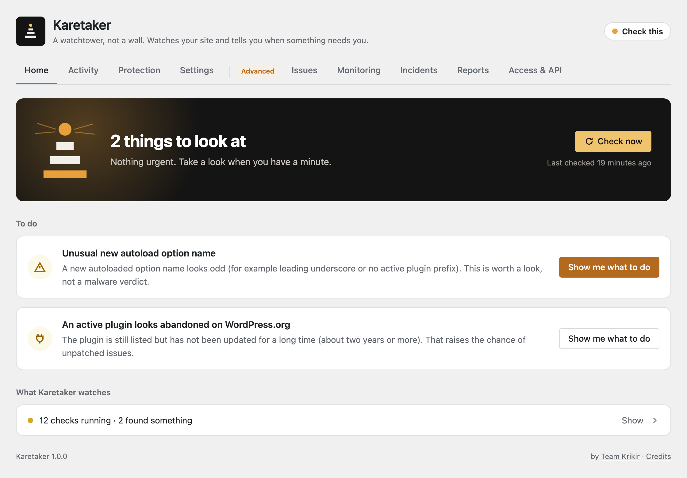
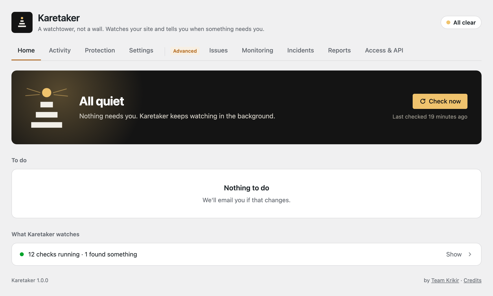
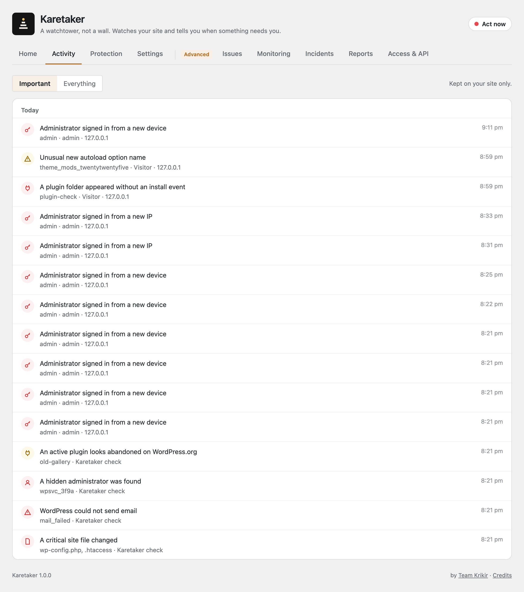
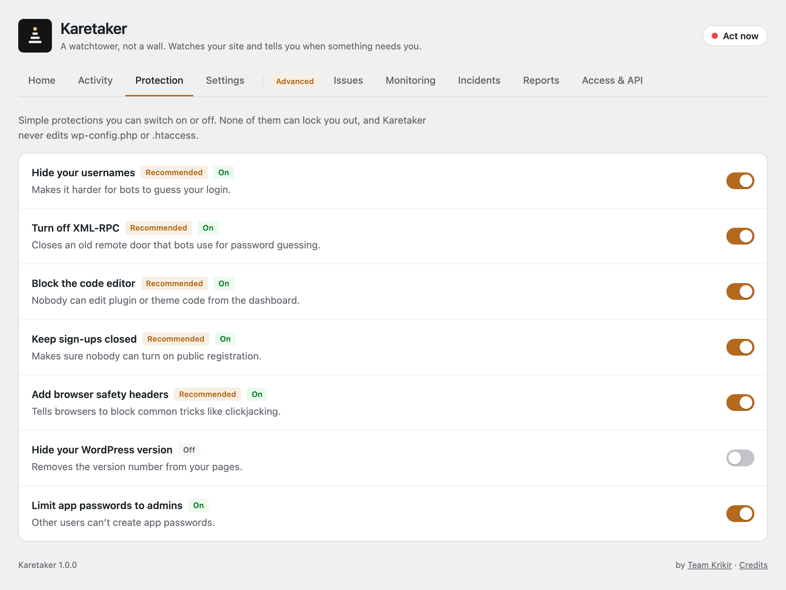
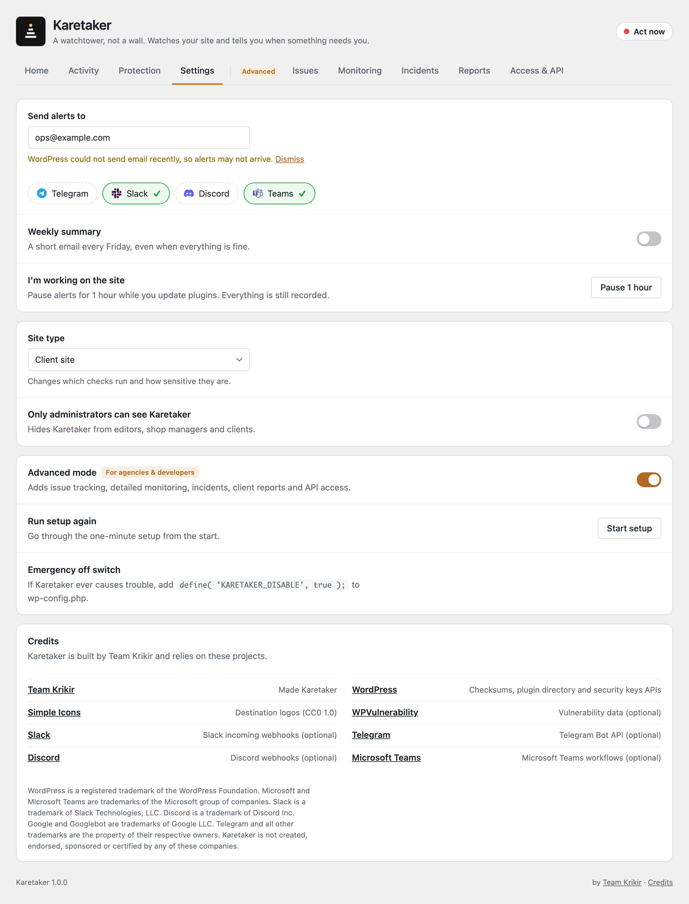
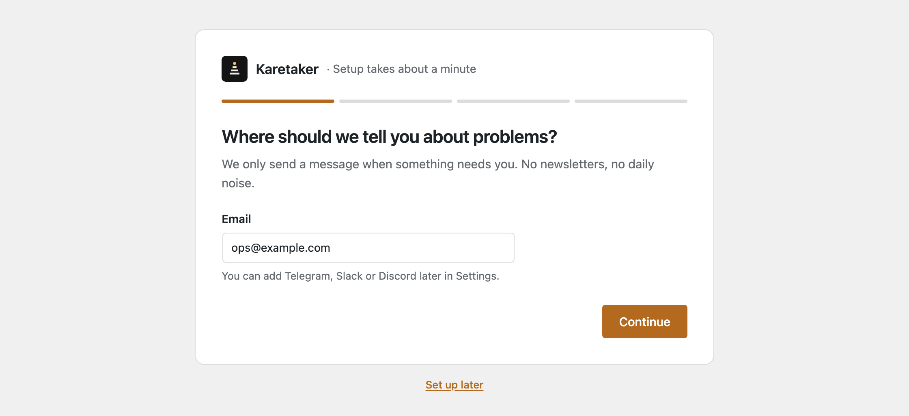

<p align="center">
  
</p>

<h1 align="center">Karetaker</h1>

<p align="center">
  <strong>A watchtower, not a wall.</strong><br>
  Watches a WordPress site for compromise signals and tells the owner only when something needs them.
</p>

<p align="center">
  <a href="LICENSE"></a>
  
  
  
</p>

---

## What it does

Karetaker opens in **Simple mode**: four screens, plain language, nothing to configure before it starts working.

| Screen | Job |
| --- | --- |
| **Home** | One headline for the whole site, a card per thing that needs you, and the twelve checks it runs |
| **Activity** | Everything it recorded, grouped by day, written for people |
| **Protection** | Optional protections you switch on or off. None of them can lock you out |
| **Settings** | Where alerts go, the weekly summary, a one-hour pause while you work, site type |

**Advanced mode** (Settings → Advanced mode) adds the screens an agency needs:

| Screen | Job |
| --- | --- |
| **Issues** | Findings grouped into issues with an owner, status and history |
| **Monitoring** | Files, users & sessions, plugin risk, scripts & SEO, and the full activity log |
| **Incidents** | Cases with a seven-step response checklist and an exportable record |
| **Reports** | Client-ready reports, plus CSV / JSON / ZIP exports |
| **Access & API** | Role permissions and read-only API tokens |

The first thing you see is a **one-minute setup**: where alerts go, what kind of site this is, a first check, and three safe protections.

Visibility is **pull** (admin screens, WP-CLI, optional signed REST endpoints). Notification is **push** (email, and optionally Telegram, Slack, Discord, Microsoft Teams or your own webhook). Hardening stays **off** until you turn each protection on.

## What it is not

Karetaker deliberately refuses the shapes that lock owners out or lie about safety:

- Not a WAF or request firewall
- Not a malware signature scanner
- Not a login lockout / hide-login product by default
- Not a writer of `wp-config.php`, `.htaccess`, or server config

No cloud account. No licence key. No registration wall.

## Screenshots

| Something needs you | Worth a look |
| --- | --- |
|  |  |

| A quiet week | Activity |
| --- | --- |
|  |  |

| Protection | Settings |
| --- | --- |
|  |  |

| Setup |
| --- |
|  |

The watchtower on Home has three states: **Act now** (red), **Check this** (amber) and **All clear**.

## Install

**From zip**

1. Download a release zip (or clone this repo and zip the plugin folder).
2. In WordPress: **Plugins → Add New → Upload Plugin**.
3. Activate **Karetaker**.
4. Open **Karetaker** in the admin sidebar.

**From Git**

```bash
cd wp-content/plugins
git clone https://github.com/jskrishna/karetaker.git
```

Then activate in **Plugins** and open the Karetaker screen.

Requirements: **WordPress 6.2+**, **PHP 7.4+**.

## Kill switch & uninstall

Stop everything immediately:

- Define `KARETAKER_DISABLE` as `true` in `wp-config.php`, **or**
- Place an empty file at `wp-content/karetaker-disable`

Uninstall removes the plugin’s events table, options, and scheduled hooks. Nothing left behind.

## Read-only API (optional)

Two read-only endpoints are available for dashboards that watch several sites:

```text
/wp-json/karetaker/v1/status
/wp-json/karetaker/v1/events
```

They stay **off** until you create a token in **Access & API** (Advanced mode). A token carries a scope (`status`, `events`), an optional IP allowlist and an optional expiry, is stored hashed, and is shown once at creation. Responses are HMAC-signed with the token. A token never grants remote control.

## Privacy

By default, Karetaker contacts WordPress.org for published core and plugin checksums and plugin directory status (the same family of APIs WordPress itself uses), and requests your own pages over loopback for the script and search-engine checks.

Everything else is off until you turn it on yourself:

- Alert emails, and messages to Telegram, Slack, Discord, Microsoft Teams or your own webhook
- The optional vulnerability lookup (plugin names and versions only)
- The read-only API endpoints, once you create a token

Karetaker does **not** phone home to Team Krikir, has no account system, and loads no third-party scripts, fonts or ads.

## Docs

| Doc | What |
| --- | --- |
| [`readme.txt`](readme.txt) | WordPress.org plugin metadata, FAQ, changelog |
| [`LICENSE`](LICENSE) | GPLv2 |

## Credits

Karetaker ships no third-party code, fonts or images. Thanks to the projects and services it relies on:

| Who | Used for |
| --- | --- |
| [WordPress](https://wordpress.org/) and the WordPress.org APIs | Core and plugin checksums, plugin directory information, security keys link, plugin changelog links |
| [WPVulnerability](https://www.wpvulnerability.com/) | Optional vulnerability lookup (plugin slug only). Vulnerability details shown in Karetaker come from WPVulnerability and the sources it links to. |
| [Slack](https://slack.com/) incoming webhooks, [Telegram](https://telegram.org/) Bot API, [Discord](https://discord.com/) webhooks, [Microsoft Teams](https://www.microsoft.com/microsoft-teams/) workflows | Optional Act now alert channels |
| [PHP_CodeSniffer](https://github.com/PHPCSStandards/PHP_CodeSniffer), [WordPress Coding Standards](https://github.com/WordPress/WordPress-Coding-Standards), [PHPCompatibilityWP](https://github.com/PHPCompatibility/PHPCompatibilityWP), [composer-installer](https://github.com/PHPCSStandards/composer-installer) | Development only (not in the plugin zip) |
| [Simple Icons](https://simpleicons.org/) | Destination logos shown in Settings (CC0 1.0) |
| [WordPress Playground](https://wordpress.org/playground/) | Local testing only |

WordPress is a registered trademark of the WordPress Foundation. Microsoft and Microsoft Teams are trademarks of the Microsoft group of companies. Slack is a trademark of Slack Technologies, LLC. Discord is a trademark of Discord Inc. Google and Googlebot are trademarks of Google LLC. Telegram and all other trademarks are the property of their respective owners. Karetaker is an independent project by Team Krikir. It is not created, endorsed, sponsored or certified by any of these companies; their names are used only to describe the services Karetaker can connect to.

## License

Karetaker is free software under the [GNU General Public License v2.0 or later](LICENSE).

---

<p align="center">
  <br>
  <sub>Built by Team Krikir for sites nobody is paid to watch.</sub>
</p>
